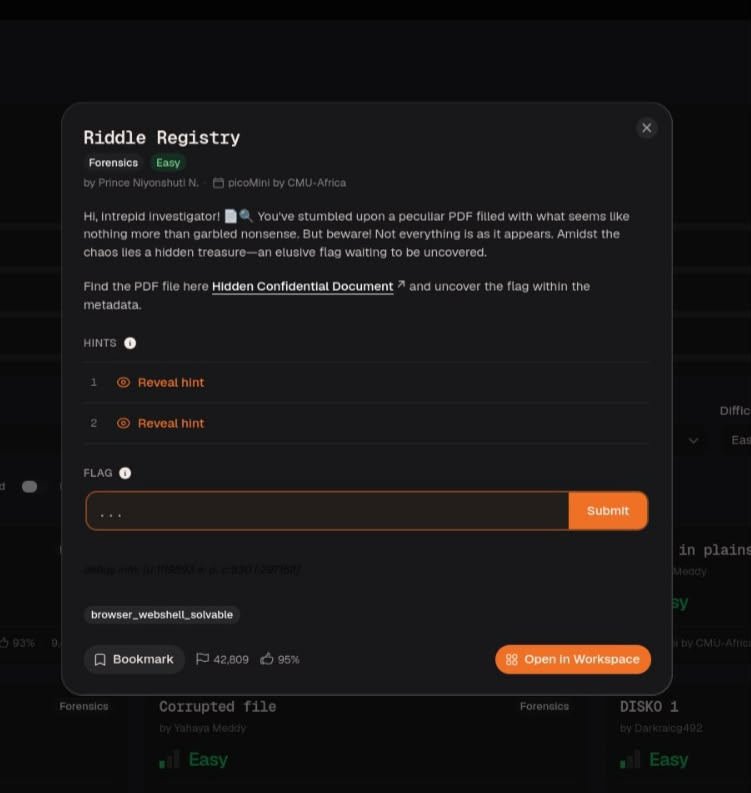
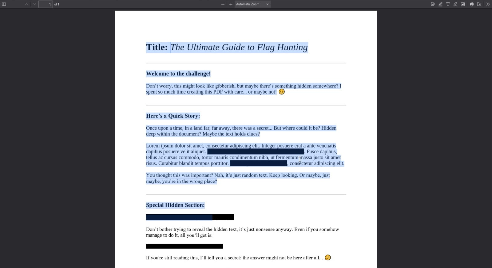
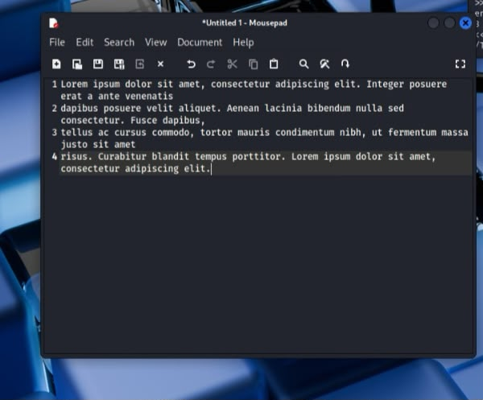
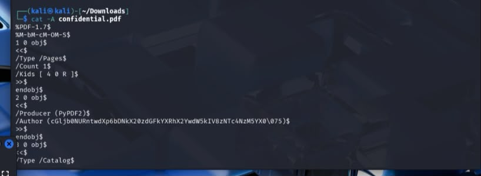
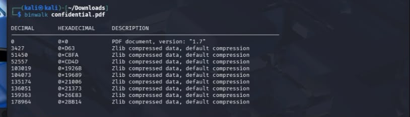
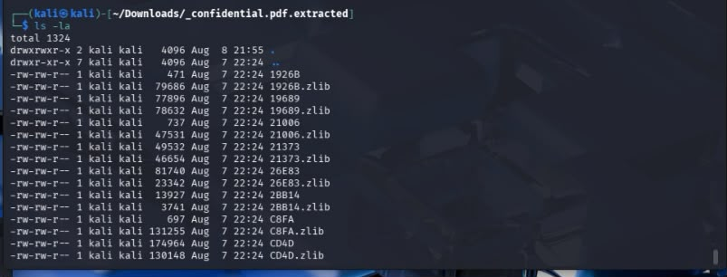
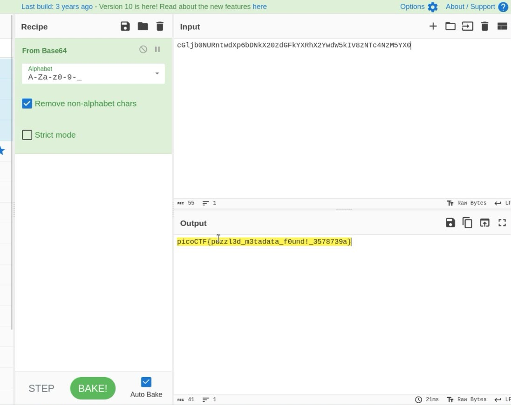

Challenge provides us a PDF file , and the description tells us there a secret (in) a file 

when I open a PDF in regular way, i noticed there is a black rectangle that hides a text behind and that make me think:{the answer should be here!!}, I continued read a text and i see a small note at the end the author said in it : a answer might not to be here after all..,that note end an idea i have it first 

but before give a guess we should to try all solutions

so I copy a text in a note to make sure a can't see a result in regular way

I know kind of that file so is not Imoprtant to do command [file] in this cause (and just in this cause and any another causes like it)
and when i print a file i noticed an author section that have an a text looks like encoding, but a skip it beacase there a lot of writes after it ( this is my false)

because of my enthusiasm i just remembered a note that author write it in end of PDF file ,that make me doing a binwalk command and because of my lack of knowledge in PDF format metadata i think that zlib file is a SECERTE that the author mean it

after some decompress and searching I make sure that I'm in a wrong way

so i return to my first noticed and focused on it and it give me a feeling that i know that encoding

yah is base64!!! (you can just use magic option to know SOME type of encoding)

thank you for read my writeups!
