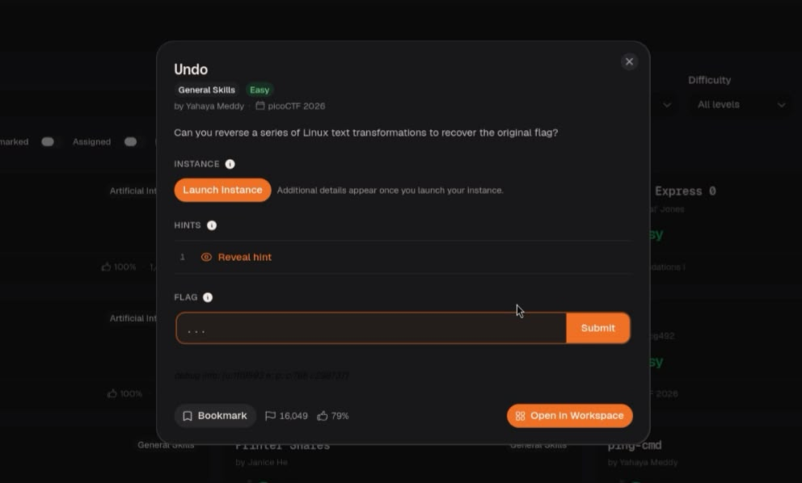
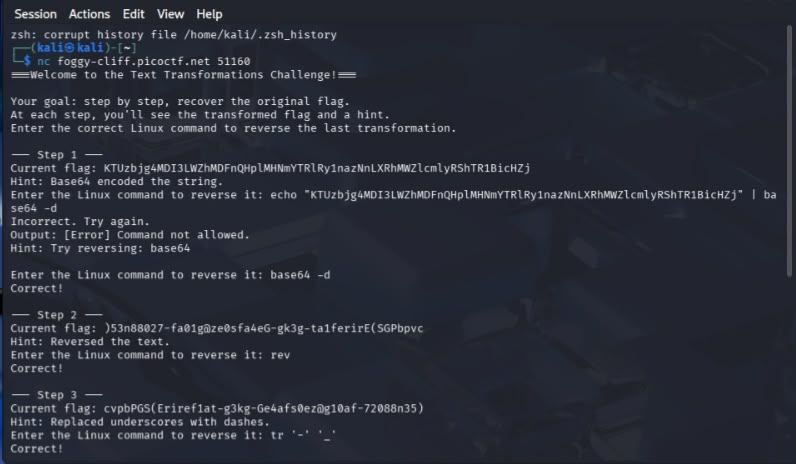
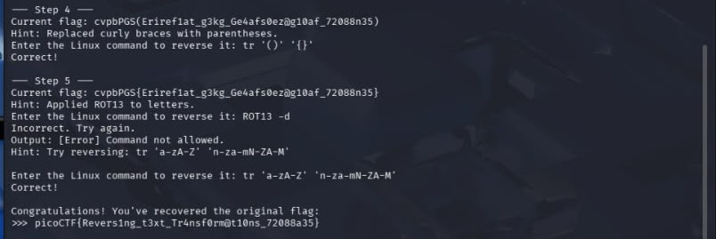

Hiiii ,today i will explain how i analyzed a Undo challenge 

a type of a challenge is(general skills) and specifically is in linux/terminal skills and more specifically is focuse on 
decoding and ciphers on a terminal{but in fact cyberchef is easier)

step1:firstly i connect by netcat (nc) command with a server that a author give me
and after that step 1 pooped up into my face ,and a step is contains 2 things: flag , hint 
,and it ask me to write just a COMMAND that a hint tells . 

in a first step I made mistake that i write whole command (with echo and pipe) so don't do that

but after that mistake i corrected it with(base64 -d ) like a hint tell

step2: in that step he ask me to revers a text so rev(reverse) command can help !!

step3: in that step he ask to replaced, and what command do you expect is a best option? correct it's tr (translat) command ,to use it in a best way you should understand it : in first '' you should write a original letter, number and punctuation marks and in a seconde '' you should write replacement value

step4: (look like step3)
step5: in first i think there a dedicated command for ROT13 but after some searching i understood that a ROT13 is just cipher that make a 13 step from letter to letter so i use tr command and i write it like that because there a capital and small letters in flag 

anddddddd congrats!! that is a last step

thank you for read my writeups!!!

